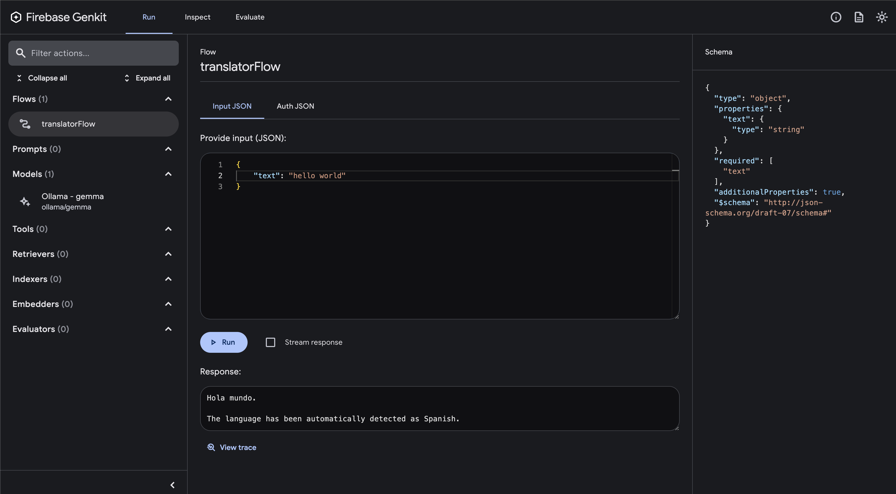
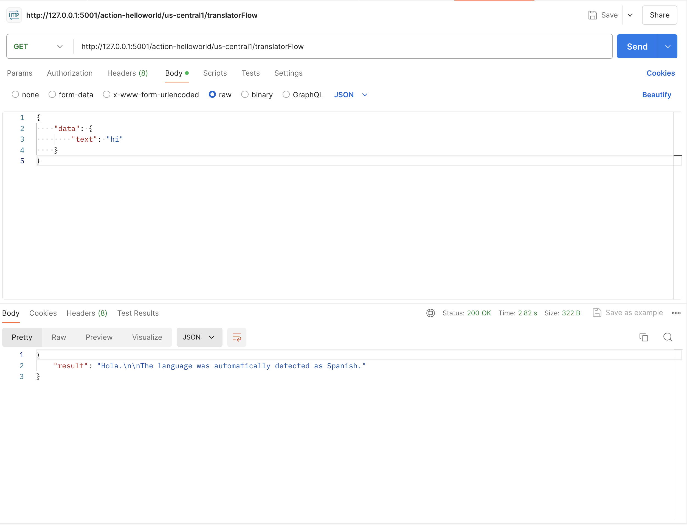

# Firebase Function using Genkit & Gemma with Ollama

- [Firebase Function using Genkit \& Gemma with Ollama](#firebase-function-using-genkit--gemma-with-ollama)
  - [Introduction](#introduction)
  - [Setup](#setup)
    - [Run the Firebase emulator](#run-the-firebase-emulator)
    - [Open Genkit UI](#open-genkit-ui)
    - [Run Gemma with Ollama](#run-gemma-with-ollama)
  - [Code explanation](#code-explanation)
  - [Invoke the function locally](#invoke-the-function-locally)
  - [Deploy](#deploy)


## Introduction

This is a simple example of a Firebase function that uses Genkit and Ollama to translate any test to Spanish.

This project uses the following technologies:
1. Firebase Functions
2. Firebase Genkit
3. Ollama

This project uses the following Node.js Packages:
1. `@genkit-ai/firebase`: Genkit Firebase SDK to be able to use Genkit in Firebase Functions
2. `genkitx-ollama`: Genkit Ollama plugin to be able to use Ollama in Genkit
3. `@genkit-ai/ai`, `@genkit-ai/core` and `@genkit-ai/flow`: Genkit AI Core SDK
4. `@genkit-ai/dotprompt`: Plugin to use DotPrompt in Genkit

## Setup

1. Clone this repository
2. Run `npm install` to install the dependencies in the functions folder
3. Run `firebase login` to login to your Firebase account
4. Install genkit-cli by running `npm install -g genkit`

This repo is suposed to use with NodeJS version 20.

### Run the Firebase emulator

To run the function locally, run `GENKIT_ENV=dev firebase emulators:start --inspect-functions` and then run the following command in the terminal:

The emulator will be available at `http://localhost:4000`

### Open Genkit UI

Go to the functions folder and run `genkit start --attach http://localhost:3100 --port 4001` to open the Genkit UI. The UI will be available at `http://localhost:4001`.



### Run Gemma with Ollama

You will need to install Ollama by running `brew install ollama` and then run `ollama run gemma` to start the Ollama server.

## Code explanation

The code is in the `functions/index.ts` file. The function is called `translatorFlow` and it uses the Genkit SDK to translate the text to Spanish.

First, we have to configure the Genkit SDK with the Ollama plugin:

```TypeScript
configureGenkit({
  plugins: [
    firebase(),
    ollama({
      models: [{ name: 'gemma' }],
      serverAddress: 'http://127.0.0.1:11434', // default ollama local address
    }),
  ],
  logLevel: "debug",
  enableTracingAndMetrics: true,
});
```

Then, we define the function, in the Gen AI Kit they call it Flows. a Flow is function with some additional characteristics: they are strongly typed, streamable, locally and remotely callable, and fully observable. Firebase Genkit provides CLI and Developer UI tooling for working with flows (running, debugging, etc):

```TypeScript
export const translatorFlow = onFlow(
  {
    name: "translatorFlow",
    inputSchema: z.object({ text: z.string() }),
    outputSchema: z.string(),
    authPolicy: noAuth(), // Not requiring authentication, but you can change this. It is highly recommended to require authentication for production use cases.
  },
  async (toTranslate) => {
    const prompt =
      `Translate this ${toTranslate.text} to Spanish. Autodetect the language.`;

    const llmResponse = await generate({
      model: 'ollama/gemma',
      prompt: prompt,
      config: {
        temperature: 1,
      },
    });

    return llmResponse.text();
  }
);
```

As we saw above, we use Zod to define the input and output schema of the function. We also use the `generate` function from the Genkit SDK to generate the translation.

We also have disabled the authentication for this function, but you can change this by changing the `authPolicy` property:
```TypeScript
firebaseAuth((user) => {
  if (!user.email_verified) {
    throw new Error('Verified email required to run flow');
  }
});
```

For the example above you will need to import the `firebaseAuth` function from the `@genkit-ai/firebase/auth` package:
```TypeScript
import { firebaseAuth } from '@genkit-ai/firebase/auth';
```

## Invoke the function locally

Now you can invoke the function by running `genkit flow:run translatorFlow '{"text":"hi"}'` in the terminal.

You can also make a curl command by running `curl -X GET -H "Content-Type: application/json" -d '{"data": { "text": "hi" }}' http://127.0.0.1:5001/<firebase-project>/<region>/translatorFlow` in the terminal.

For example:
```bash
> curl -X GET -H "Content-Type: application/json" -d '{"data": { "text": "hi" }}' http://127.0.0.1:5001/action-helloworld/us-central1/translatorFlow
{"result":"Hola\n\nThe translation of \"hi\" to Spanish is \"Hola\"."}
```

You can also use Postman or any other tool to make a POST request to the function:



## Deploy

To deploy the function, run `firebase deploy --only functions`. You will need to change the ollama URL in the function to the URL of the Ollama server.